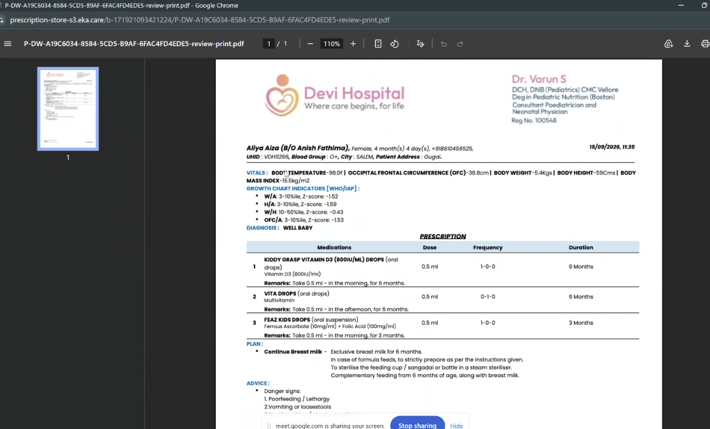
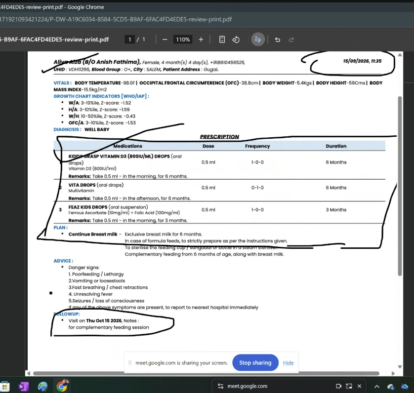

# Electronic Medical Records (EMR) Project Requirements

**Status:** Working draft  
**Audience:** Developers and stakeholders  
**Product reference:** [Eka Care](https://www.eka.care/)  

## 1. Project overview

The project will create an electronic medical records system for healthcare practices. It should support the work of doctors, nurses, receptionists, and pharmacists, including storing and retrieving patient records and generating a complete visit report.

Eka Care is the product reference. The first release requirements below are based on the scope shared so far and the supplied screenshots; detailed constraints and implementation decisions are still to be added.

## 2. Users and access

The system must support login for these staff roles:

- Doctor
- Nurse
- Receptionist
- Pharmacist
- Super doctor, acting as the user administrator for a hospital

The super doctor must be able to manage users for their hospital. The specific user-management actions and permissions for each role remain to be defined.

## 3. First-release scope

The first release must include the following screens or screen areas:

1. **Login**
2. **Patients**
   - Add patient
   - Search patients
   - View patient details
   - View a patient's past visits
3. **Clinical pad / visit record**
   - Complaints
   - History of Present Illness (HOPI)
   - Development
   - Immunization
   - Examination
   - Impression
   - Lab tests
   - Follow-up
4. **User management**
5. **Inpatient (IP)**
   - Daycare patients list

## 4. Patient and visit records

- Staff must be able to add a patient, search for a patient, and view patient details.
- A patient record must provide access to past visits.
- A visit must support the clinical pad sections listed in the first-release scope.
- The fields, validation rules, and which roles may view or edit patient and visit information are open decisions.

## 5. Generated report

When patient details have been entered and a report is generated, the full report must contain the information represented in the supplied reference screenshots:

### Report reference screenshots

Click either image to open the full-size screenshot.

The reference report visibly includes patient and doctor/hospital identification, visit date and time, vitals, growth indicators, diagnosis/impression, prescribed medications with dose/frequency/duration and remarks, plan, advice, and follow-up. Confirm which of these sections are required and whether any other information from the screenshots must appear in the generated report.

## 6. Success criteria

The first release is successful when:

- A staff user can add a patient, search for a patient, and view patient details.
- A doctor, nurse, receptionist, and pharmacist can each log in to the EMR.
- A hospital's super doctor can manage users.

## 7. Constraints and decisions to capture

Pending input:

- Product, technical, deployment, budget, and timeline constraints.
- Data privacy, security, regulatory, and hosting requirements, including the operating region.
- Decisions about supported devices, integrations, and whether the system serves one or multiple hospitals.
- Detailed role permissions and the user-management actions available to the super doctor.
- Required patient fields, search behavior, and past-visit details.
- Which staff roles can create, edit, sign, and generate visit reports.
- Whether the generated report must match the reference layout or only include its information.
- How daycare patients enter and leave the IP list, and what actions staff need from that list.

## 8. Open questions

1. What constraints or decisions should developers and stakeholders treat as fixed (region, privacy/regulatory needs, hosting, platform, integrations, budget, or timeline)?
2. Is each hospital a separate workspace, with its own super doctor and users? Should users ever belong to more than one hospital?
3. Should the report reproduce the visual layout in screenshots 4 and 5, or include the same information in a different layout? Are the screenshots the complete required report?
4. What actions should the super doctor be able to perform in user management (for example, add, edit, deactivate users, assign roles, or reset access)?
5. What should the daycare patients list show, and what should staff be able to do from it?

## 9. Reference material

- Product reference: [Eka Care](https://www.eka.care/)
- Supplied screenshots: `screenshots/`
